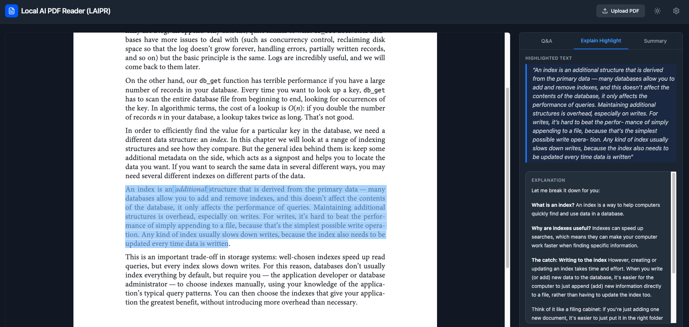

# Local AI PDF Reader (LAIPR)



A privacy-first, browser-based PDF reader that connects directly to your local [Ollama](https://ollama.com/) instance to supercharge your reading experience. No data leaves your machine!

## ✨ Features

- **Read PDFs Locally**: Upload and render any standard PDF document perfectly in your browser.
- **Document Q&A**: Ask questions about the currently open document. The AI will use the document's content as context to find the answer.
- **Highlight Explanations**: Select any complex text in the PDF, and the AI will explain it simply and clearly using surrounding context.
- **AI Summarization**: Generate a comprehensive summary of the entire document with a single click.
- **Dark Mode Support**: Easy on the eyes for late-night reading and researching.
- **Fully Private & Open Source**: Powered by your local Ollama instance. No APIs, no subscriptions, and complete data privacy.

## 🚀 Getting Started

### Prerequisites

You must have [Ollama](https://ollama.com/) installed and running on your machine.
By default, the app expects Ollama to be available at `http://localhost:11434`.

**Important**: Because the browser connects to Ollama directly, you *must* configure Ollama with the appropriate CORS headers.

Start the Ollama server explicitly with wildcard origins:

```bash
OLLAMA_ORIGINS="*" ollama serve
```

### Installation

1. Clean install the project dependencies:
   ```bash
   npm install
   ```

2. Start the development server:
   ```bash
   npm run dev
   ```

3. Open the provided `localhost` URL in your browser.

## ⚙️ Configuration

In the top right corner of the application window, click the Settings (gear) icon to:
- Change the Ollama API URL if you are hosting it on another device within your network.
- Switch the active AI Model (e.g., `llama3`, `mistral`, `phi3`). Ensure you have downloaded the model in Ollama via `ollama pull <model-name>` prior to selecting it.
